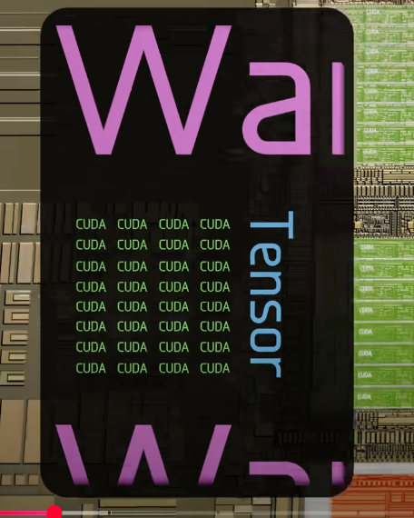
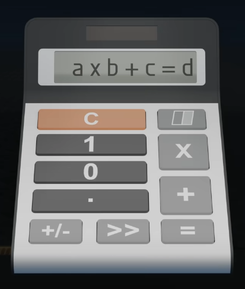
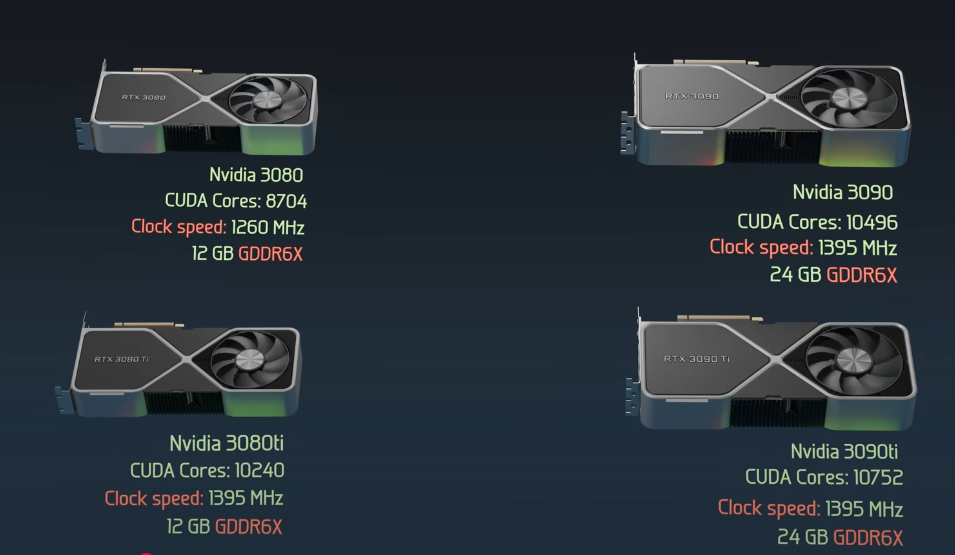
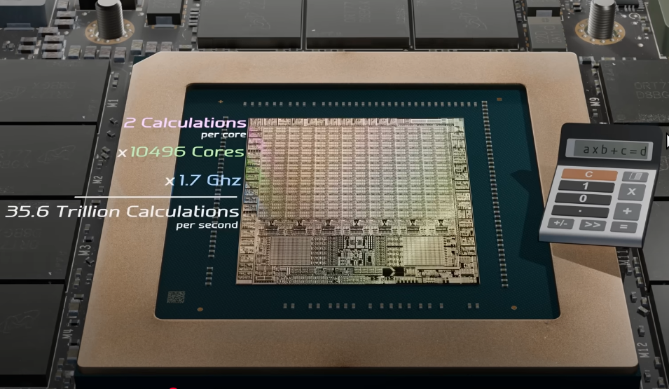

## Resource 
* Branch Education : [Click Here]()

Super mario = 100 million
Mine craft = 100 billion
Cyberpunk = 36 trillion a second (4400 earth people did this calculation)
## GPU vs CPU
* GPU have 10000 cores and the CPU have a chip of 24 cores
* But we can't say GPU is best than the CPU
* CPU is flexible that can run varipus type of application 
* CPu run in OS,Input devices or network
* GPU is faster if we want to claculate the massive amount of data 
* If we have less data and it need to be calculated faster m then CPU is faster
## GPU GA102 Architecture
* In Graphic card , we have PCB where all the components are stored
* GPU have GA102 built from 28.3 billion transistor
* The majority area is taken by the processing cores and it is divided into 7 GPC
* Each Graphics Processing Cluster have 12 streaming multiprocesor
* Each streaming multiprocessor have 4 warps and 1 ray tracing core
* Inside each ward ,  we have 32 CUDA or shade core and 1 tensor core

* So totally we have 10752 CUDA cores , 336 Tensor cores , 84 Ray Tracing Cores
* CUDA Cores : It do the simple binary calculator operation

* Tensor Cores : They are matrix multiplication and matrix addition calculations and used for gemoetric transformations and it works with neural network and AI
* Ray Tracing Core : They are used to execute ray tracing algorithms
* eg:Nvidia 3080,3080ti,3090,3090ti,

## CUDA Core
* Inside CUDA Core we have 410000 transistor on that 50000 trasformet performes an operation called FMA (Fused Multiply and Add [A * B + C])
* On that halfo do the 32-bit floating point FMA and other half do 32 bit integer FMA or float FMA
* It will do 1 multiply and 1 add in one clock cycle

Finished upto 12:30 sec
