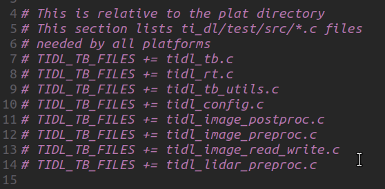

## Resources 
* TIDL Build and Run Instructions : [Click Here](https://software-dl.ti.com/jacinto7/esd/processor-sdk-rtos-jacinto7/08_00_00_12/exports/docs/tidl_j7_08_00_00_10/ti_dl/docs/user_guide_html/usergroup2.html)
* Installation Manual : [Click Here](./Installation_Manual.pdf)
## Setup Tutorial in Ubuntu
### To install SDK
* Click The link : [Here](https://www.ti.com/tool/download/PROCESSOR-SDK-RTOS-J721E/09.00.01.01)
* And download "ti-processor-sdk-rtos-j721e-evm-09_00_01_01-prebuilt.tar.gz" File
* To open Terminal : Ctrl + Alt + T
### To export the path 
1. Open Terminal
1. open bashrc script with nano or vim
```sh
vi  ~/.bashrc
```
1. Enter the following text
```sh
export TIDL_INSTALL_PATH=~/PSDKRA/ti-processor-sdk-rtos-j721e-evm-09_00_01_01/c7x-mma-tidl
export TIDL_GRAPHVIZ_PATH=/usr
export PSDK_INSTALL_PATH=~/PSDKRA/ti-processor-sdk-rtos-j721e-evm-09_00_01_01
export SOC=j721e
```

### To install dependencies
* All the dependencies  should be installed inside ti-processor-sdk-rtos-j721e-evm-09_00_01_01 directory
1. Graphviz tool
    ```sh
    cd ${PSDK_INSTALL_PATH}
    sudo apt install graphviz-dev
    ```
    * We need to build this inside the TIDL_INSTALL_PATH directory
    ```sh
    cd ${TIDL_INSTALL_PATH}
    TARGET_PLATFORM=PC make gv
    ```
1. Google Protobuf
    ```sh
    cd ${PSDK_INSTALL_PATH} # If you are in this directory then leave it
    wget https://github.com/protocolbuffers/protobuf/releases/download/v3.11.3/protobuf-cpp-3.11.3.tar.gz 
    tar -xvzf protobuf-cpp-3.11.3.tar.gz
    ```
1. Google Flatbuffer
    * Download tar file form this [link](https://github.com/google/flatbuffers/releases/tag/v1.12.0)
    
    
    ```sh
    cd ${PSDK_INSTALL_PATH}
    tar -xvzf flatbuffers-1.12.0.tar.gz
    ```
1. Open CV
    * Download tar file form this [link](https://github.com/opencv/opencv/releases/tag/4.1.0)
    
    ```sh
    cd ${PSDK_INSTALL_PATH}
    tar -xvzf opencv-4.1.0.tar.gz
    ```
## Building the dependencies
1. OpenCV
    ```sh
    cd ${PSDK_INSTALL_PATH}
    cd opencv-4.1.0/cmake
    cmake -DBUILD_opencv_highgui:BOOL="1" -DBUILD_opencv_videoio:BOOL="0" -DWITH_IPP:BOOL="0" -DWITH_WEBP:BOOL="1" -DWITH_OPENEXR:BOOL="1" -DWITH_IPP_A:BOOL="0" -DBUILD_WITH_DYNAMIC_IPP:BOOL="0" -DBUILD_opencv_cudacodec:BOOL="0" -DBUILD_PNG:BOOL="1" -DBUILD_opencv_cudaobjdetect:BOOL="0" -DBUILD_ZLIB:BOOL="1" -DBUILD_TESTS:BOOL="0" -DWITH_CUDA:BOOL="0" -DBUILD_opencv_cudafeatures2d:BOOL="0" -DBUILD_opencv_cudaoptflow:BOOL="0" -DBUILD_opencv_cudawarping:BOOL="0" -DINSTALL_TESTS:BOOL="0" -DBUILD_TIFF:BOOL="1" -DBUILD_JPEG:BOOL="1" -DBUILD_opencv_cudaarithm:BOOL="0" -DBUILD_PERF_TESTS:BOOL="0" -DBUILD_opencv_cudalegacy:BOOL="0" -DBUILD_opencv_cudaimgproc:BOOL="0" -DBUILD_opencv_cudastereo:BOOL="0" -DBUILD_opencv_cudafilters:BOOL="0" -DBUILD_opencv_cudabgsegm:BOOL="0" -DBUILD_SHARED_LIBS:BOOL="0" -DWITH_ITT=OFF ../
    # Run the make file
    make
    ```
1. Protobuf
    ```sh
    cd ${PSDK_INSTALL_PATH}
    cd protobuf-3.11.3/
    ./configure CXXFLAGS=-fPIC --enable-shared=no LDFLAGS="-static"
    make
    ```
1. Flatbuffer
    ```sh
    cd ${PSDK_INSTALL_PATH}
    cd flatbuffers-1.12.0/
    cmake -G "Unix Makefiles" -DCMAKE_BUILD_TYPE=Release -DCMAKE_CXX_FLAGS="-Wno-class-memaccess"
    make
    ```
1. Tensorflow
    ```sh
    cd ${PSDK_INSTALL_PATH}
    git clone --depth 1 --single-branch -b tidl-j7 https://github.com/TexasInstruments/tensorflow.git
    ````
1. Onnxruntime
    ```sh
    cd ${PSDK_INSTALL_PATH}
    git clone --depth 1 --single-branch -b tidl-j7 https://github.com/TexasInstruments/onnxruntime.git
    ```
1. TVM 
    ```sh
    cd ${PSDK_INSTALL_PATH}
    git clone --single-branch -b tidl-j7 https://github.com/TexasInstruments/tvm
    cd tvm
    git submodule init
    git submodule update --init --recursive

    ```
## Build the TIDL PC Tools
* Before that just refer this file
```sh
ti-processor-sdk-rtos-j721e-evm-09_00_01_01/c7x-mma-tidl/makerules/config.mk
```

* In this i change the directory path for the tensorflow and see the PSDK_TOOLS_PATH , it will be helpful in upcoming process
```sh
cd ${PSDK_INSTALL_PATH}
cd sdk_builder/
make tidl_pc_tools -j # I have a 8GB RAM so i can't completely run this process so i just used j2 in the place of j
make
```
### Build command to run TIDL-RT
```sh
cd ${TIDL_INSTALL_PATH}
make TARGET_PLATFORM=PC
make
```
### Running Custom Test App
* Go to the directory
```
cd ti-processor-sdk-rtos-j721e-evm-09_00_01_01/c7x-mma-tidl/ti_dl/test/src/pc_linux/
```

* In this , delete platform_defines.h file and modify the main.c program with the hello_world.c
```c
#include<stdio.h>
int main(){
    printf("Hello World");
    return 0;
}
```
* In ti-processor-sdk-rtos-j721e-evm-09_00_01_01/c7x-mma-tidl/ti_dl/test/src/concerto_common.mak comment out the following code
```
TIDL_TB_FILES += tidl_tb.c
TIDL_TB_FILES += tidl_rt.c
TIDL_TB_FILES += tidl_tb_utils.c
TIDL_TB_FILES += tidl_config.c
TIDL_TB_FILES += tidl_image_postproc.c
TIDL_TB_FILES += tidl_image_preproc.c
TIDL_TB_FILES += tidl_image_read_write.c
TIDL_TB_FILES += tidl_lidar_preproc.c
```

* Go to the ti-processor-sdk-rtos-j721e-evm-09_00_01_01/c7x-mma-tidl/ti_dl/test/ directory and run the following command
    ```sh
    make TARGET_BUILD=debug TARGET_PLATFORM=PC 
    ```
* To run the output code
    ```sh
    cd ti-processor-sdk-rtos-j721e-evm-09_00_01_01/c7x-mma-tidl/ti_dl/test/out/PC/x86_64/LINUX/debug/
    ./PC_dsp_test_dl_algo.out
    ```

# Error I got
## 1. memset error while do the makefile for flatbuffer

* While doing cmake , add the following flag
```sh
cmake -G "Unix Makefiles" -DCMAKE_BUILD_TYPE=Release -DCMAKE_CXX_FLAGS="-Wno-class-memaccess"
# Then run make
make
```
## 2. Tensorflow command
```
while running make TARGET_PLATFORM=PC command in buildinf TIDL_RT , it says that tensorflow is not found
```
* To solve this , go to the ti-processor-sdk-rtos-j721e-evm-09_00_01_01/c7x-mma-tidl/makerules/config.mk and change the 
```
TF_REPO_PATH?=$(PSDK_INSTALL_PATH)/targetfs/usr/include/tensorflow

To

TF_REPO_PATH ?=$(PSDK_INSTALL_PATH)/tensorflow
```

## 3. c7x.h is not loaded

* For this i download the c7x dsp compiler by manual from this [link](https://www.ti.com/tool/download/C7000-CGT/4.1.0.LTS) 
* create a **ti** directory in the home and store the file and run the command
    ```sh
    ./ti_cgt_c7000_4.1.0.LTS_linux-x64_installer.bin
    ```
* See the path is stored in config.mk

    

## 4.Running the test makefile 
```
It didnt genetate PC_dsp_test_dl_algo.out file in ti-processor-sdk-rtos-j721e-evm-09_00_01_01/c7x-mma-tidl/ti_dl/test/out/PC/x86_64/LINUX/debug/ directory
```

* Solution is we need to comment some line in ti-processor-sdk-rtos-j721e-evm-09_00_01_01/c7x-mma-tidl/ti_dl/test/src/pc_linux/concerto.mak
```
68 # STATIC_LIBS += tidl_custom
71 # STATIC_LIBS += tidl_algo
72 # STATIC_LIBS += tidl_obj_algo
73 # STATIC_LIBS += tidl_priv_algo
116 # STATIC_LIBS += IlmImf
126 # STATIC_LIBS += tidl_avx_kernels
```