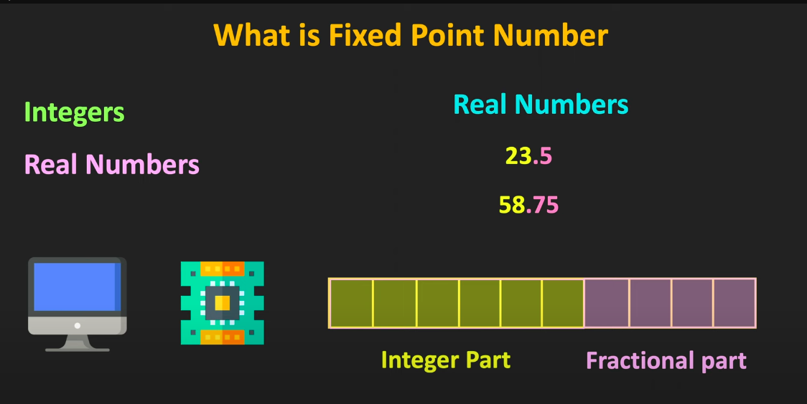
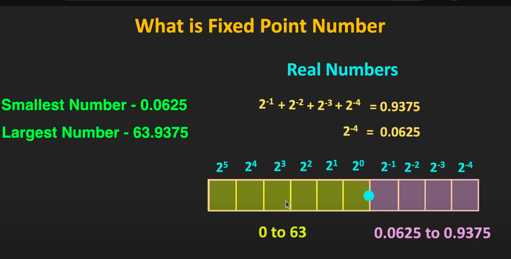
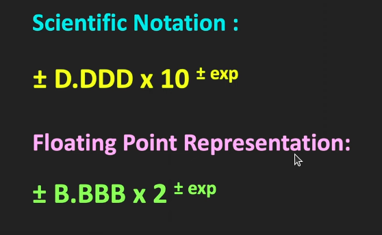
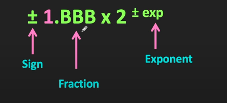
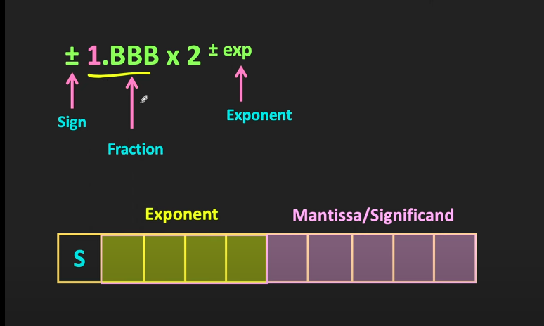

## Floating Point vs Fixed Point
### Fixed  Point : 
* The digit on the left od radix point is integer part and right is fractional part

* Here the position of the radix point or decimal point remains fixed eg.Integer

### Floating Point : 
* The number with very large or very small number can be represented using floating point numbers
* It provides good range and precision
* The reperesentation of the floating point is similar to scientific notation (10234 -> 1.0234 * 10^4) . Like we have only one significant digit before the decimal point and the significant digit before the decimal point should be non zero (0.22*10^2  is not a valid number)
* Significant digit (1.222) also called as mantissa
* 1.3223*10^4 , here 1.3223 is significant digit and 10^4 is exponent digit here we have decima number so that we have the base 10

* In floating point , the only possible significat bit before the binary point is 1

#### Normalization in Floating Point Numbers
* Example : (111.101)2 -> 1.11101x102
* When the radix point / binary point is shifted left by 1 bit position the exponent will be incremented by 1 , and shift by right means decrement by 1 (0.01001)2 -> 1.001x10^-2
#### How floating point is stored

* In Sign bit(S) , 1 means negative value
* The integer part of the significant always be 1 so it wont stored and only store the fractional part 
* See about IEEE754 standard
# C66X DSP
* 32-bit floating point : 
    * one bit is used for the sign, 8 bits for the exponent, and 23 bits for the fraction (mantissa) and it used IEEE754 Standard
    * It is specially designed to handle the mathematical operations need to do some special tasks like compressing and filtering      
    * It is used in complex calculation where we have very high as well as very low values
* Programmable Functional Units :
    * These have different functional units which is specialized in specific tasks
    * L1/L2 - USed for Load/Store operation
    * S1/S2 - For special operations (bit manipulation , address calculation)
    * M1/M2 - USed to do the multiplication operations
        * Audio Signal Processing (e.g., applying a filter to an audio signal),
        * Image Processing (e.g., convolution for edge detection or blurring)
    * D1/D2 - For Division operations and also handle other complex operation (normalizing , transformation)
* Global register files (32x2, 32bit registers) : 
    * It is used to store data temporary during operations inorder to reduce the access time
    * 32x2 - 32 pairs of registers, and each register is 32 bits wide
* Cache-Based Memory System (L1D – 32KB, L1P – 32KB, L2 – 256KB):
    * In most modern processor cache is divided into 2 (data cache holds the data and instruction cache)
    * L1D - Level 1 data cache ,used to store the  the data
    * L1P - Level 1 Program cache ,used to store the  the Instruction(program code)
    * L2 Cache - Used to store both data and Program it is larger than L1
* Dual 64-bit Data Paths:
    * Data path : It is used to carry the data into differennt part of the system(ALU,Memory,Registor)
    * 64 bit data path means , it handle 64 bit of the data in single operation (add,sub,read,write)
    * Dual 64 bit data path means it have 2 independent 64 bit data path which can do their work in parallel , like in a single clock we can do data stream simultaneouly and increase the throughput
* Packed SIMD Operations (8-bit, 16-bit, 32-bit, 64-bit):
* Supports 16bit/32bit complex types
* Supports 128bit vector types (Quad 32bit)
* Supports 32 16bit multiply-accumulate per cycle
* Supports 16 single precision operations per cycle :
    * It contains 16 Floating point operationg in single cycle and used in audio mixing and video decoding
* Supports 40bit operations
* Software pipelining, special SPLOOP HW 
    * SPLOOP HW (Software Pipelining Loop Hardware) is a special hardware feature in the C66x DSP architecture designed to optimize software pipelined loops, which are commonly used in digital signal processing applications.

