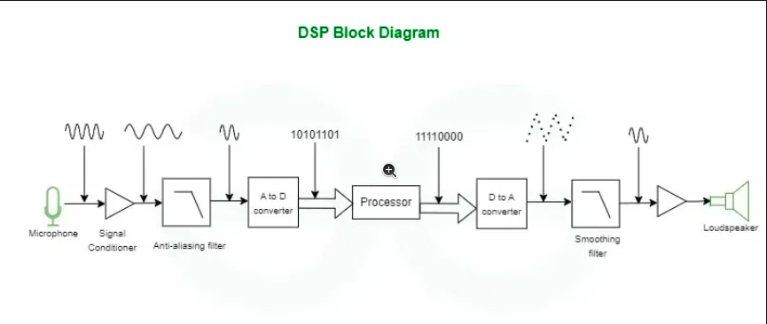

### Common Terms
filtering ,compression, modulation , SNR , Quantization error , pitch , Fourier transforms ,Bottlenecks , transducer , CMOS , PMOS

* Analog Signal :  It is continuous signal , which means it has continuous current and voltage than can very over time
* ADC : Analog to Digital Convertor is used to convert the analog signal into digital signal this is because computer and other digital system can only read digital data . It contains Sampling, quantization, and encoding .
* DSP : It used some algorithm to manipulate and improve the digital signal which is converted by the ADC . It contains Filtering, enhancement, compression
* Transducer : Converts one form of enery into another form of energy
### What is DSP
* Digital Signal processing is used to read the digital signal for improving the feature or get essential feature
* It is used in audio processsing , medical processing and control system
* It have the capability to differentiate normal and noise signal and it wont give the perfect result

### Why digital signal is better than Analog Signal
* It produce less affected by noise which uses the discrete signal so that we can easily differentiate the values in noise environment
* Digital Signal have the quantization error which is much typically smaller than the error in analog signal

### Uses of DSP processor
* When we convert analog signal to the digital signale we got some noise error , To correct this we use DSP processor 
* To impreve the wuality of this signale it contains various techniques like filtering , smoothening .

### Uses of DSP in Audio
* DSP used in music company to impove the music quality and generate new sounds
* Noise reduction is dont by having a noise gate which have some threshold values,it if any of the value os below the threshold then we reject the signal which is noise
* Equalization is used to modify the signal's frequency response to enhance the audio quality
* Compression is used to reduce the audio size which takes less time to transmission
* Pitch correlation usid to produce the particulare sound effect 

### Components of DSP processor
* DSP is a hardward structure because it have seperate memory space for instruction and data and also it need to do some processes in parallel which von neuman can't do
* DSP is a real time signal processing so we have deterministic and low latency we need
* The components are
    * Program Memory : This contains all the program 
    * Data Memory : This contains the data
    * Compute Engine : This is the heart of DSP used to execute the instruction from the Program memory and execute the data from data memory
    * Input/Output : This contains all the outside components

### Digital Signal Processing System

* First it will take the input form transducer device (microphone) and the electriccal signal is send into the op-amp which improve the amplitude of the signal and then pass into the antialiasing filer
* Antialiasing filter used to eliminate the higher frequency by having the threshold rate this is because we want a signal lesser than the half of the sampling frequency
* The filtered signal is passed into the ADC which converts the Analog to Digital Signal and converted into bits 
* By that data we can do the performance and analyse the data through DSP processor anf then it is send to DAC 
* And we use Low pass filter to remove the unwanted higher frequency signal and smootehn the signal
* With the help of Op-Amp that has output transducer ie Speaker

### My doubts
* Why frequency domain is better than the time domain 
* use of op-Amp

## To Learn
# Topics to Learn for DSP Architecture

To understand and learn **DSP (Digital Signal Processing) architecture**, you should have a strong foundation in the following topics:

---

## 1. Basics of Digital Signal Processing
- Sampling and quantization
- Nyquist-Shannon Sampling Theorem
- Analog-to-Digital Conversion (ADC) and Digital-to-Analog Conversion (DAC)
- Anti-aliasing filters
- Discrete-time signals and systems
- Difference equations

---

## 2. Digital Filters
- Types of filters (Low-pass, High-pass, Band-pass, Band-stop)
- Finite Impulse Response (FIR) filters
- Infinite Impulse Response (IIR) filters
- Filter design techniques (e.g., Butterworth, Chebyshev, Windowing methods)

---

## 3. Transforms and Frequency Analysis
- Fourier Transform (FT)
- Discrete Fourier Transform (DFT) and Fast Fourier Transform (FFT)
- Z-Transform
- Laplace Transform (for understanding analog systems)
- Frequency domain representation of signals

---

## 4. DSP Algorithms
- Convolution and correlation
- Signal reconstruction and interpolation
- Decimation and interpolation
- Adaptive filtering

---

## 5. Computer Architecture Basics
- Von Neumann vs. Harvard architecture
- Memory hierarchy (cache, RAM, etc.)
- Data buses and address buses

---

## 6. DSP-Specific Architecture Concepts
- Multiply-Accumulate (MAC) unit
- Pipelining and parallel processing
- Fixed-point vs. floating-point arithmetic
- Circular buffering
- Specialized instruction sets for DSP
- Control vs. data flow

---

## 7. Microprocessors and Controllers
- Basic understanding of microcontrollers and microprocessors
- Embedded systems concepts
- Real-time constraints

---

## 8. Real-World Applications
- Audio and speech processing
- Image and video processing
- Communications systems
- Sensor signal processing

---

## Recommended Steps:
1. Strengthen your understanding of **digital signal processing basics** (signals, systems, filters, etc.).
2. Learn about **computer architecture** (especially Harvard architecture, pipelining, etc.).
3. Study **DSP processor features** (e.g., Texas Instruments TMS320, ARM Cortex, etc.).
4. Implement small projects or simulations to understand DSP concepts practically using tools like MATLAB, Python, or C++.

By building expertise in these areas, you will have a strong grasp of DSP architecture and its applications!
