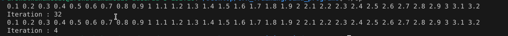

## Total Sum Calculation
### Question
```
Practice Program (2-1) is a program for finding the sum total of 1 to 1024.
Rewrite this program so that it can perform SIMD operations.
```
### PSEUDO CODE
1. Iniliatize the maximum value as 1024
1. Create a 2 vector with initialized as 8 and 0
1. create an another vector contain sequence of number from 1-8
1. Do add operation between sum and value vector , value and step vector and icnrement the loop by 8
1. Store the sum in result array and add every value to get eh output
### Output

### Need to improve
* Code need to work for all dimensions
## Float Multiply
### Question
```
Practice Program (2-2) is a program for multiplying integers 1 to 32 individually by 0.1.
Rewrite this program so that it can perform SIMD operations.
```
### PSEUDO CODE
```
Initialize valriables
Assign input values
Iterate from 0 to size - 1
    Load input values
    Convert it into float
    Multiply with 0.1 float vector and store the temporary result
```
### Output

### Need to improve
* Code need to work for all Sizes