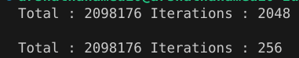

## Total Sum Calculation
### PSEUDO CODE
1. Iniliatize the maximum value as 1024
1. Create a 2 vector with initialized as 8 and 0
1. create an another vector contain sequence of number from 1-8
1. Do add operation between sum and value vector , value and step vector and icnrement the loop by 8
1. Store the sum in result array and add every value to get eh output
* Output

