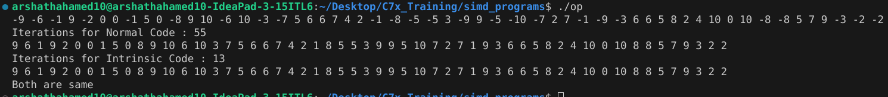
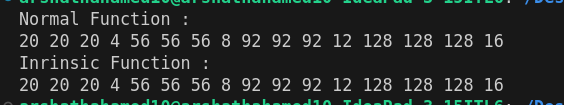

## Total Sum Calculation
### Question
```
Practice Program (2-1) is a program for finding the sum total of 1 to 1024.
Rewrite this program so that it can perform SIMD operations.
```
### PSEUDO CODE
1. Iniliatize the maximum value as 1024
1. Create a 2 vector with initialized as 8 and 0
1. create an another vector contain sequence of number from 1-8
1. Do add operation between sum and value vector , value and step vector and icnrement the loop by 8
1. Store the sum in result array and add every value to get eh output
### Output

### Need to improve
* Code need to work for all dimensions
## Float Multiply
### Question
```
Practice Program (2-2) is a program for multiplying integers 1 to 32 individually by 0.1.
Rewrite this program so that it can perform SIMD operations.
```
### PSEUDO CODE
```
Initialize variables
Assign input values
Iterate from 0 to size - 1
    Load input values
    Convert it into float
    Multiply with 0.1 float vector and store the temporary result
```
### Output

### Need to improve
* Code need to work for all Sizes
## Absolute Value
### Question
```
Obtain the absolute values for 16 real numbers defined in a scalar array. Rewrite this program so that it can perform SIMD operations.
```
### PSEUDE CODE
```
Initialize variables
Assign input values
Iterate from 0 to size - 1
    Load input values
    Create the pattern/mask
    Create a Negative vector
    Use blend between Negative vector and input vector
    Store the result
Handle the remaning values 
```
### Output

## RGB To Gray Scale
### Question
```
Practice Program (2-4) shows a code snippet taken from a program used to convert color images into grayscale images. More precisely, it displays the rgb2y() function that undertakes grayscale conversion.
Rewrite this function so that it can perform SIMD operations.
Grayscale conversion involves extraction of brightness data Y from each pixel’s RGB values to make it possible to render images composed of shades of gray. The formula used for brightness calculation is shown below.
(Brightness calculation formula)　fY(R, G, B) ＝ R x 0.29891 + G x 0.58661 + B x 0.11448
```
### PSEUDE CODE
```
Initialize variables
Assign input values
Load input values
Unpach the low and high values
Shuffle the vector
Multiply the seperate RGB value to its constant
ADD everything and store it in result
Store the result
```
### Problem 
* it wont work for all the dimensions
### Output
